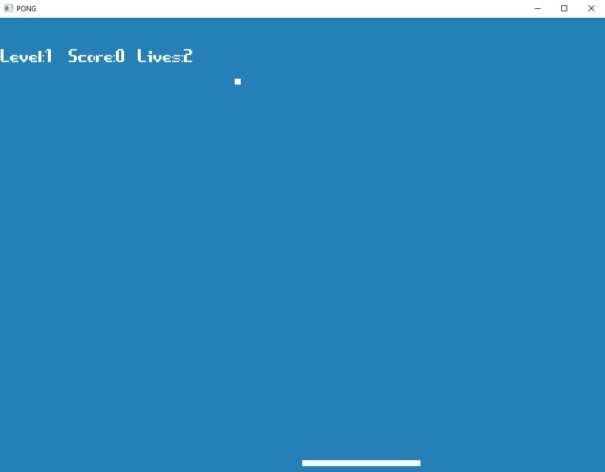

# Pong Game

## Introduction
This is simple pong game built as introduction to using C++ and SFML (Simple Fast Media Library). 
The game keeps track of the user's score, lives, and the level. As the levels increase, the pong ball speeds up making the game more difficult.

